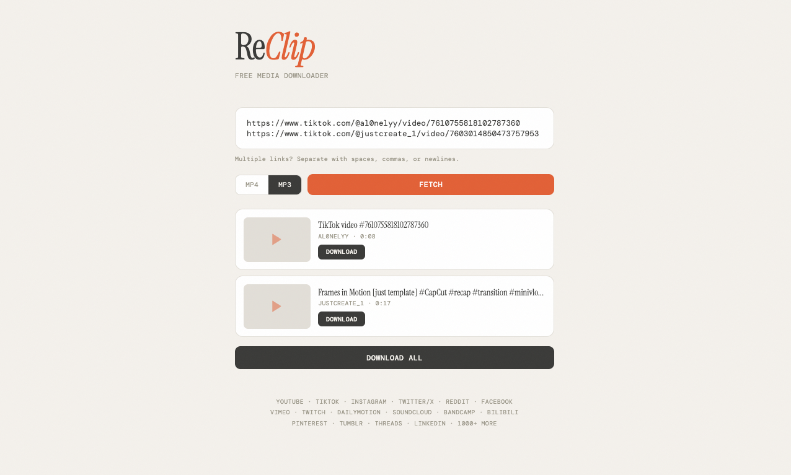

# Clippa

Clippa é um downloader leve de mídia para YouTube, TikTok, Instagram, X, Reddit, Vimeo, SoundCloud e outras plataformas suportadas por `yt-dlp`.

Ele pode rodar no navegador ou como app nativo de macOS.




## Download e Instalação

Se você só quer baixar e usar no Mac:

1. Abra a última release:
   `https://github.com/marcoraza/clippa/releases/latest`
2. Baixe `Clippa-mac-unsigned.dmg`
3. Abra o `.dmg`
4. Arraste `Clippa.app` para `Applications`
5. Clique com o botão direito no app e escolha `Open`
6. Confirme o aviso do macOS

Alternativa:

- a release também inclui `Clippa-mac-unsigned.zip`

Observação:

- a build pública atual é `unsigned`
- na primeira abertura o macOS pode bloquear
- isso é esperado, porque o app não está notarizado pela Apple

Se o macOS continuar bloqueando:

1. Tente abrir o app uma vez
2. Abra `System Settings`
3. Vá em `Privacy & Security`
4. Role até a seção de segurança
5. Clique em `Open Anyway`
6. Abra `Clippa.app` de novo

Guia detalhado: [INSTALL-macOS.md](INSTALL-macOS.md)

## Uso

1. Cole um link
2. Escolha `MP4` ou `MP3`
3. Clique em `Fetch`
4. Selecione a qualidade disponível
5. Salve o arquivo

## Rodar do código-fonte

### Requisitos

- Python 3.8+
- `ffmpeg`
- `yt-dlp`

macOS com Homebrew:

```bash
brew install ffmpeg yt-dlp
```

Linux:

```bash
sudo apt install ffmpeg
pip install yt-dlp
```

### Iniciar a versão web

```bash
git clone https://github.com/marcoraza/clippa.git
cd clippa
./reclip.sh
```

Abra:

- `http://localhost:8899`

Para expor na rede local:

```bash
HOST=0.0.0.0 PORT=8899 ./reclip.sh
```

## Gerar o app de macOS

O projeto consegue empacotar a si mesmo como `.app`.

```bash
git clone https://github.com/marcoraza/clippa.git
cd clippa
./reclip.sh
venv/bin/python -m pip install -r requirements-desktop.txt
./scripts/build-macos-app.sh
open dist/Clippa.app
```

O build faz isso:

- empacota o backend Flask dentro do app
- inclui `ffmpeg` e `ffprobe`
- gera `dist/Clippa.app`

## Gerar um DMG pronto para distribuição

Se você quiser gerar um instalador `.dmg` sem Apple Developer:

```bash
./scripts/release-macos-dmg.sh
```

Isso gera:

- `dist/Clippa.app`
- `dist/Clippa-mac-unsigned.dmg`

## Gerar um zip pronto para distribuição

Se você quiser gerar uma build pronta para enviar, sem Apple Developer:

```bash
./scripts/release-macos-unsigned.sh
```

Isso gera:

- `dist/Clippa.app`
- `dist/Clippa-mac-unsigned.zip`

Observação:

- a build funciona normalmente
- ela não é notarizada pela Apple
- em outro Mac, a primeira abertura exige confirmação manual

## Rodar em segundo plano no macOS

Se você quiser deixar o Clippa disponível mesmo depois de fechar o Terminal:

```bash
./reclip.sh
./scripts/install-macos-service.sh
```

Comandos úteis:

```bash
launchctl print gui/$(id -u)/com.marko.clippa
tail -f logs/clippa.out.log
tail -f logs/clippa.err.log
./scripts/uninstall-macos-service.sh
```

## Plataformas suportadas

Clippa funciona com qualquer fonte suportada por `yt-dlp`, incluindo:

- YouTube
- TikTok
- Instagram
- X / Twitter
- Reddit
- Vimeo
- Twitch
- SoundCloud
- Dailymotion
- LinkedIn
- muitas outras

## Releases assinadas

Se você tiver conta Apple Developer, o repo também inclui scripts para assinatura e notarização:

- `scripts/store-notary-credentials.sh`
- `scripts/release-macos-app.sh`

Esses scripts são opcionais. A release pública atual usa o fluxo unsigned para simplificar a instalação.

## License

MIT. Veja [LICENSE](LICENSE).

## Aviso

Use com responsabilidade. Respeite os termos das plataformas e os direitos autorais do conteúdo baixado.
